Registry:
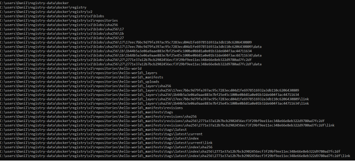

Auth:
Тест 1: Без аутентификации
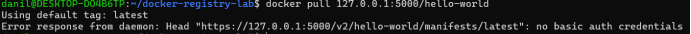

С неправильным паролем:
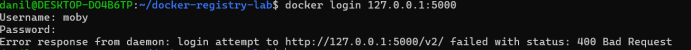

С правильным паролем:
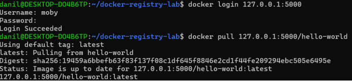

# Docker Orchestration Hands-on Lab

Характеристика узлов в режиме Active до перевода в Drain:
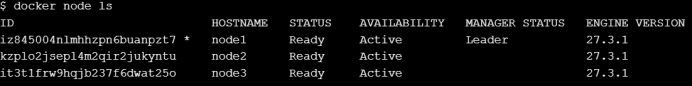
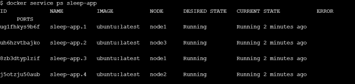
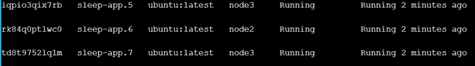

После перевода node2 в Drain:
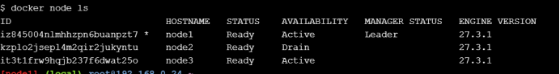
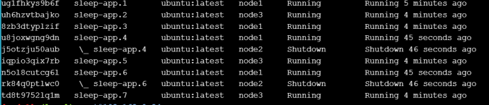

Восстанавливаем в Active node2:
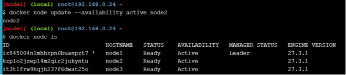
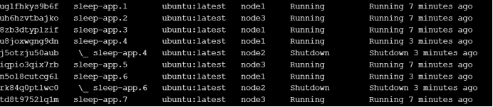

Работа сервисов на node2 не восстановилась!

Чтобы восстановить работу, нужно добавить новые задачи.

# Swarm stack introduction

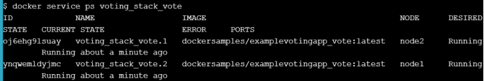

# Репозиторий со счетчиком:

Нагрузочное тестирование с 1 репликой:
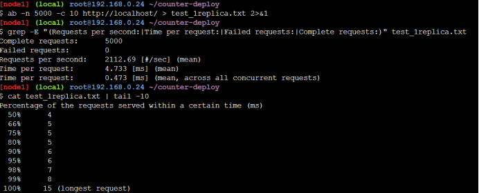

Нагрузочное тестирование с 4 репликами:

Производительность выросла на 30% (с 2112 до 2740 RPS), среднее время отклика уменьшилось на 22% (с 4.73 до 3.65 мс),  хвост распределения ухудшился - максимальное время выросло с 15 до 36 мс.

Особенность реплицирования redis: то, что создадутся два разных redis с разными данными. Надо работать с помощью redis-master, redis-replica.